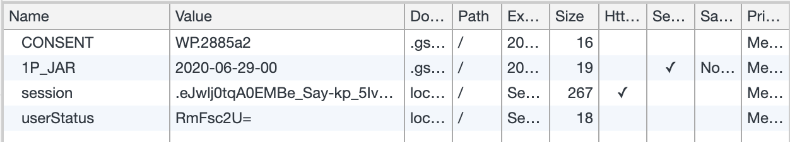
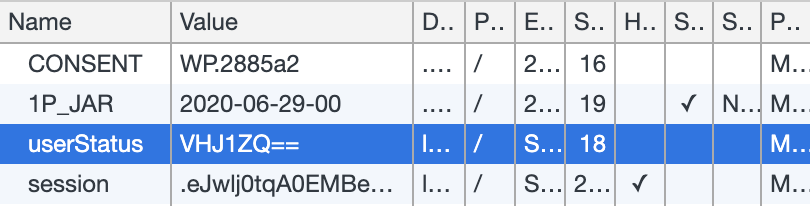
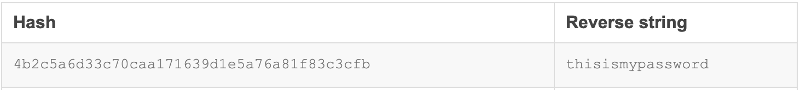
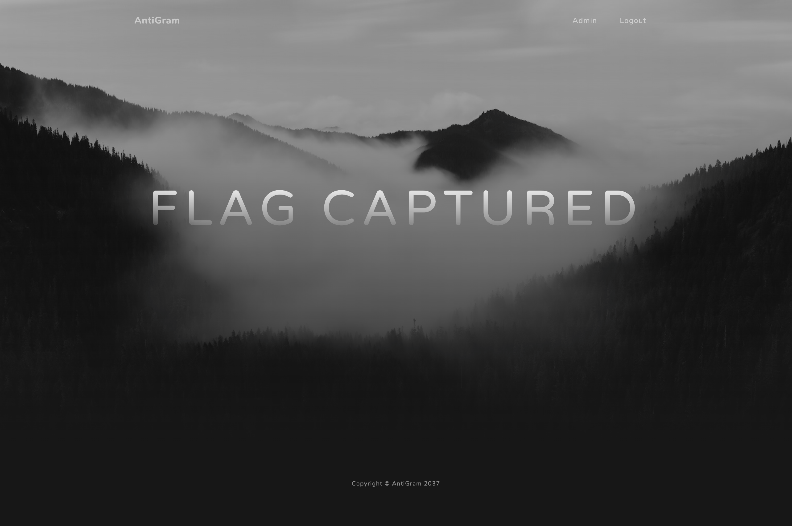

# AntiGram
A simple web application designed as a CTF (capture the flag) to increase awareness about security vulnerabilities.

## Contents
* [Purpose](#purpose)
* [Setup](#setup)
* [Vulnerabilities (answers)](#vulerabilities-(answers))
* [License](#license)

## Purpose

Capture the flag is a game where the objective is to find and exploit vulnerabilities to get to an end goal. AntiGram is a CTF and a simple web application that has multiple vulnerabilities (the answers can be found below). The purpose of AntiGram is to increase awareness about specific vulnerabilities in order to prevent developers making these errors, which increases the security of software in general. 

The objective within AntiGram is to gain access to my account. Good luck!

## Setup

### Mac OS example
#### Clone the repository
```
git clone https://github.com/abhinandshibu/AntiGram.git
```

#### Navigate into the directory of the repository
```
cd AntiGram
```

#### Create a virtual environment and install the requirements
```
python3 -m venv venv
. venv/bin/activate
pip install -r requirements.txt
```

#### Run it
```
FLASK_APP=antigram.py
flask run
```

## Vulnerabilities (answers)

Below is the process to solving the CTF, please try to find these vulnerabilities yourself first.

### From the landing page, move to the sign up page and create an account.


### You will be greeted by a welcome page.


### It's interesting that there is an admin button on the top right.


### When you click on it, a message appears stating that you are not an admin.


### It should be obvious that you need to gain admin rights and after searching for a while, you may decide to look at the cookies.


### In particular you may notice the userStatus cookie. This is where you will notice the first two vulnerabilities. 
The data appears as a random string of characters, though after closer inspection you can desern that the data has been encoded in base 64. A few people believe encoding information makes it secure, however that is false. It may hide the information from the common eye and appear as random characters, however someone who is knowledgeable can easily try some different decoding algorithms. The goal of encoding is not to keep information secret, rather it is used for the storage and transmission of data.

In addition, you should never store information such as admin rights in a cookie! If you do, you definitely need backend validation and should cross check with the database. AntiGram just reads the cookies values when deciding whether you are an admin or not, hence you can trick the system into believing you are an admin by chaing the cookie values. The decoded userStatus cookie returned False, so it is obvious we should replace it with the encoded value of True.

This comes under the OWASP Top Ten 2017, as [A5:2017-Broken Access Control](https://owasp.org/www-project-top-ten/OWASP_Top_Ten_2017/Top_10-2017_A5-Broken_Access_Control). It is a very common vulnerability that needs to be prevented.

#### Before


#### After


### Admin rights allows you to see the database
Although you have gained access to the database, you still need to gain access to my account. Unfortunately for you, you may have noticed that all the passwords have been hashed. This is good practice, passwords should NEVER be stored in plaintext.


### The third and fourth vulnerability
Unfortunately for me, you may decide to do a quick google search of my hashed password. This leads to a SHA1 rainbow table exposing my password, allowing you to login to my account. Hashing algorithms like SHA1 and MD5 are outdated and not suitable for security purposes! Though they are suitable for quick checks and non security related functionality. You should use more secure hashing algorithms such as SHA512. Lastly, salt should be used, as it prevents rainbow tables from being effective. This will keep accounts secure, even if the login information has been breached.

More information about these vulnerabilities can be found on the OWASP website. [CWE-759](https://cwe.mitre.org/data/definitions/759.html): Use of a One-Way Hash without a Salt. [CWE-916](https://cwe.mitre.org/data/definitions/916.html): Use of Password Hash With Insufficient Computational Effort.



### Now you just have to log into my account and congrats, you have captured the flag!


