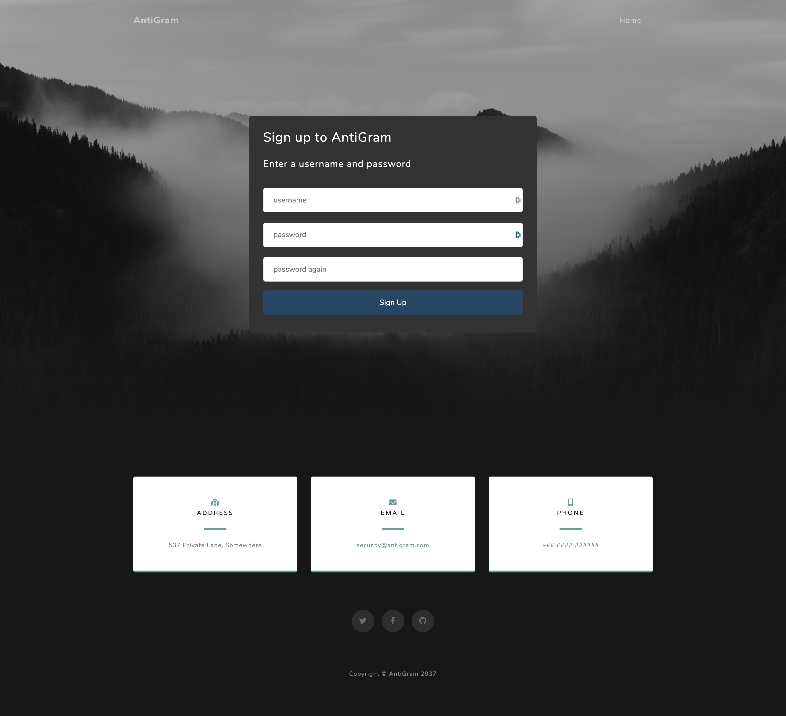
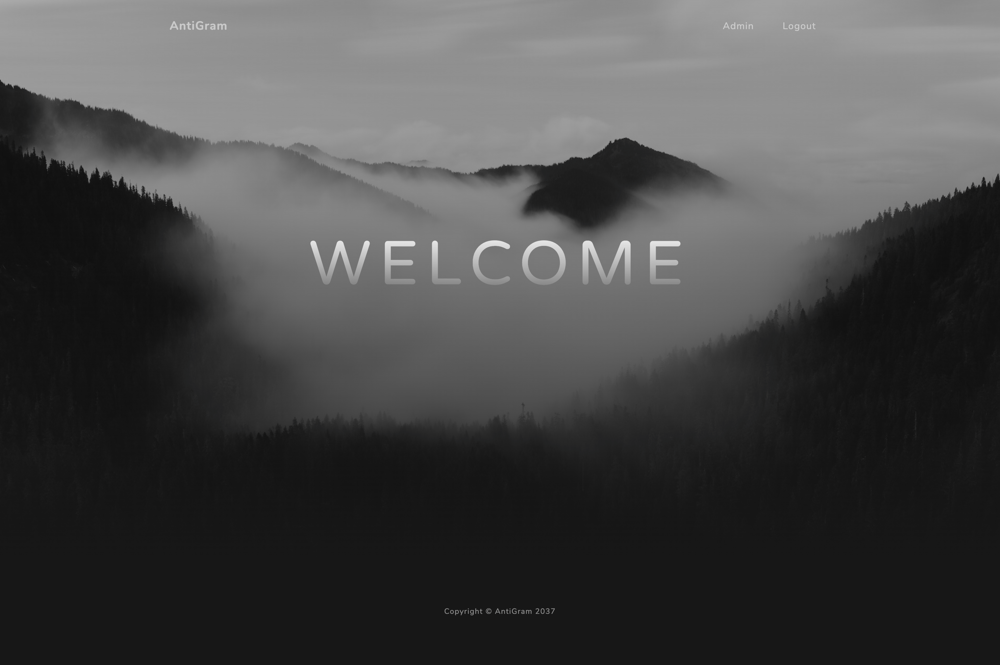
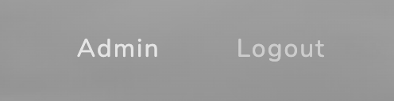
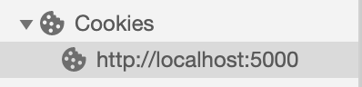
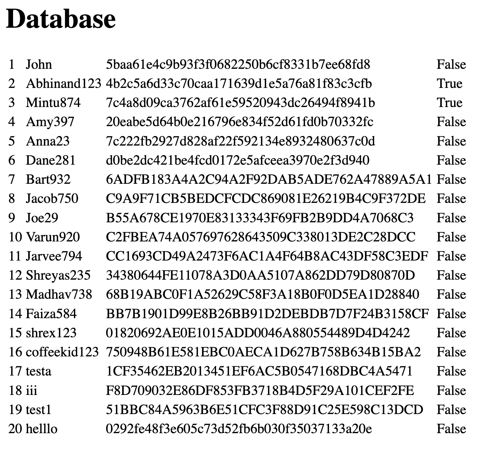

# AntiGram
A simple web application designed as a CTF (capture the flag) to increase awareness about security vulnerabilities.

## Contents
* [Purpose](#purpose)
* [Setup](#setup)
* [Vulnerabilities (answers)](#vulerabilities-(answers))
* [License](#license)

## Purpose

Capture the flag is a game where the objective is to find and exploit vulnerabilities to get to an end goal. AntiGram is a CTF and a simple web application that has multiple vulnerabilities (the answers can be found below). The purpose of this game is to increase awareness about specific vulnerabilities in order to prevent developers making these errors, which increases the security of software in general.

## Setup

### Mac OS example
#### Clone the repository
```
git clone https://github.com/abhinandshibu/AntiGram.git
```

#### Navigate into the directory of the repository
```
cd AntiGram
```

#### Create a virtual environment and install the requirements
```
python3 -m venv venv
. venv/bin/activate
pip install -r requirements.txt
```

#### Run it
```
FLASK_APP=antigram.py
flask run
```

## Vulnerabilities (answers)

Below is the process to solving the CTF, please try to find these vulnerabilities yourself first.

#### Start off with the landing page.

#### Then move to the sign up page and create an account.

#### You will be greeted by a welcome page.

#### It should be interesting at this point that there is an admin button on the top right.

#### When you click on it, a message appears stating that you are not an admin.

#### It should be obvious at this point that you need to gain admin rights. After searching for a while, you may notice the cookies.

#### In particular you may notice the userStatus cookie, and this is where you will notice the first two vulnerabilities. 
The data appears as a random string of characters, though at closer inspection you can desern that the data has been encoded in base 64. A few people believe encoding information makes it secure, however that is false. It may hide the information from plain sight, and appear as random characters, though someone can easily take that information and try some different decoding algorithms until it the correct one is found. The goal of encoding is not to keep information secret, rather it is used for the storage and transmission of data.

In addition, you should never store information such as admin rights in a cookie! If you do, you definitely need backend validation and cross check with the database. Though AntiGram just reads the cookies values when deciding whether you are an admin or not, hence the cookie values can be easily changed to trick the system into believing you are an admin. The decoded userStatus cookie returned False, so it is obvious we should replace it with the encoded value of True.
##### Before

##### After


#### Admin rights allows you to see the database, and this is where you will notice the third vulnerability.
Although you have gained access to the database, you still need to gain access to my account.



## License

Copyright © 2020 Abhinand Shibu

This project is licensed under the [MIT License](/LICENSE).
